# disentangling-factors-of-variation-using-adversarial-training

This repository contains a pytorch implementation for the paper: Disentangling factors of variation in deep
representations using adversarial training (https://arxiv.org/abs/1611.03383), which was accepted at NIPS 2016. The paper proposes
an adversarial architecture to disentangle factors of variation into two separate latent codes based on a single source of supervision.

The repository provides files necessary to train this architecture on MNIST dataset, while it can be generalised to other datasets in
the paper by changing the data_loader and networks files.

The code has been tested with the following python interpreter and library versions:

 - python 3.6.3
 - pytorch 0.4.0
 - torchvision 0.2.1
 - argparse 1.1
 - numpy 1.13.3
 - matplotlib 2.2.2
 - tensorboardX 1.2

We have used this work for comparison in our paper: Disentangling Factors of Variation with Cycle-Consistent Variational Auto-encoders (https://arxiv.org/abs/1804.10469).
The code for our work is uploaded at https://github.com/ananyahjha93/cycle-consistent-vae.

### Tricks to stabilize the adversarial architecture

Before we move on to the results, we mention some of the tricks/GAN hacks used in this implementation to stabilize the training:

 - "Training the discriminator only when the accuracy of the previous batch was less than 80%." This trick was first proposed in
'Learning a Probabilistic Latent Space of Object Shapes via 3D Generative-Adversarial Modeling' (http://3dgan.csail.mit.edu/papers/3dgan_nips.pdf),
and we found the claim that it stabilizes training to be quite true. The idea is simple, if the discriminator is way ahead of the generator,
the generator will not be able to extract good signal from the gradient of the discriminator.

 - "We train the generator 2 times for each iteration of discriminator training." (Opposite of this hack is mentioned on this repository of
 GAN hacks: https://github.com/soumith/ganhacks, i.e. train the discriminator more)

 - Instead of using an embedding layer to provide class labels as additional channels in the discriminator
 (GAN hacks: https://github.com/soumith/ganhacks), we pass pairs of images to the discriminator. This way, we reduce the level of supervision
 required to only pairwise instead of actual class labels. We also found that this method was faster and more stable than using an embedding layer.

## Results

### Image generation by swapping class and style embeddings

We were able to replicate the visual results of disentangling factors of variation from the paper.
The first column is MNIST, the second is 2D Sprites and the third is LINE-MOD. 'z dim' here refers to the dimensionality of the
unspecified factors latent space (style latent space) described in the paper.

<table style="width:100%">
    <tr>
        <td align="center">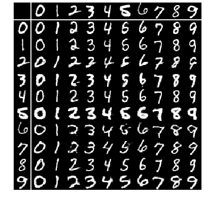</td>
        <td align="center">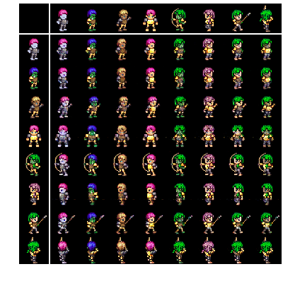</td>
        <td align="center">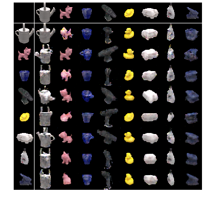</td>
    </tr>
    <tr>
        <td align="center">z dim: 16</td>
        <td align="center">z dim: 512</td>
        <td align="center">z dim: 64</td>
    </tr>
    <tr>
        <td align="center"></td>
        <td align="center">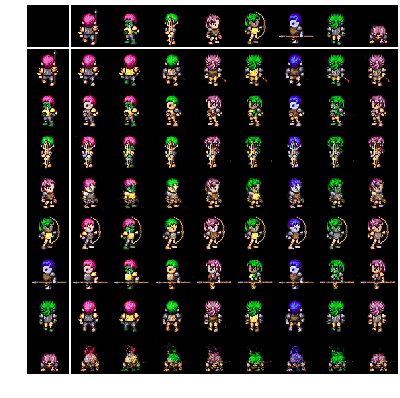</td>
        <td align="center">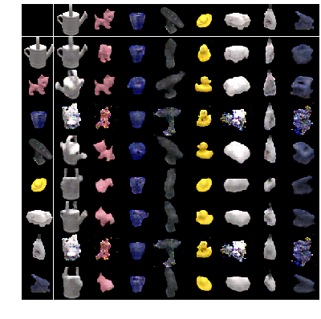</td>
    </tr>
    <tr>
        <td align="center">z dim: 64</td>
        <td align="center">z dim: 1024</td>
        <td align="center">z dim: 256</td>
    </tr>
</table>

### Classification results on latent spaces

In the table below, we present the results of classification on both the specified factors (class, s) and unspecified factors (style, z) latent codes.
Ideally, the specified factors latent space should have a classification accuracy as high as possible and the unspecified factors latent space should
have a classification accuracy as low as possible.

z - > unspecified factors latent space (style) | s -> specified factors latent space (class)

<table style="width:100%">
  <tr>
    <th>Dataset</th>
    <th>z dim</th>
    <th>s dim</th>
    <th>z train acc.</th>
    <th>z test acc.</th>
    <th>s train acc.</th>
    <th>s test acc.</th>
  </tr>
  <tr>
    <td>MNIST</td>
    <td>16</td>
    <td>16</td>
    <td>70.85</td>
    <td>66.83</td>
    <td>99.37</td>
    <td>98.52</td>
  </tr>
  <tr>
    <td>MNIST</td>
    <td>64</td>
    <td>64</td>
    <td>74.94</td>
    <td>72.20</td>
    <td>99.94</td>
    <td>98.64</td>
  </tr>
  <tr>
    <td>2D Sprites</td>
    <td>512</td>
    <td>64</td>
    <td>12.05</td>
    <td>11.98</td>
    <td>99.18</td>
    <td>96.75</td>
  </tr>
  <tr>
    <td>2D Sprites</td>
    <td>1024</td>
    <td>512</td>
    <td>12.48</td>
    <td>12.25</td>
    <td>99.22</td>
    <td>97.45</td>
  </tr>
  <tr>
    <td>LINE-MOD</td>
    <td>64</td>
    <td>256</td>
    <td>90.14</td>
    <td>89.17</td>
    <td>100.00</td>
    <td>100.00</td>
  </tr>
  <tr>
    <td>LINE-MOD</td>
    <td>256</td>
    <td>512</td>
    <td>86.87</td>
    <td>86.46</td>
    <td>100.00</td>
    <td>100.00</td>
  </tr>
</table>

### t-SNE plot of latent spaces

The following are t-SNE plots of the unspecified factors latent space (style latent space) for the MNIST dataset. Ideally they should not have
any structure corresponding to class labels. As we see for the figure on left, the t-SNE plot does show structure hence proving that adversarial
architectures, while producing good quality images, do not exactly produce disentangled representations. Instead, they train the decoder to ignore
any class specific information present in the style latent space.

The plot on the right shows a style latent space that is highly mixed and it is difficult to see any structure in it. This is obtained when
we reparameterize the output of style latent space as in a VAE training. This shows that reparameterization during training helps add to class confusion
in the style latent space. The classification results presented above are taken after reparameterization. Even after reparameterization,
although there is no visible structure, a trained classifier can still identify class labels for MNIST fairly easily. The same goes for LINE-MOD.

<table style="width:100%">
    <tr>
        <td align="center">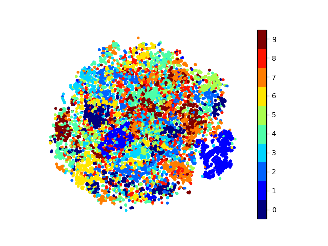</td>
        <td align="center">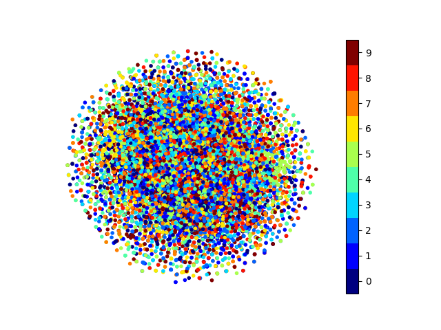</td>
    </tr>
</table>

### Graphs of loss function

Finally, we also include graphs of different loss functions to show how they progressed during the training:

Reconstruction loss

<table style="width:100%">
    <tr>
        <td align="center">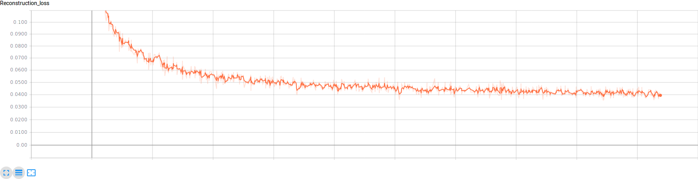</td>
    </tr>
</table>

KL-divergence

<table style="width:100%">
    <tr>
        <td align="center">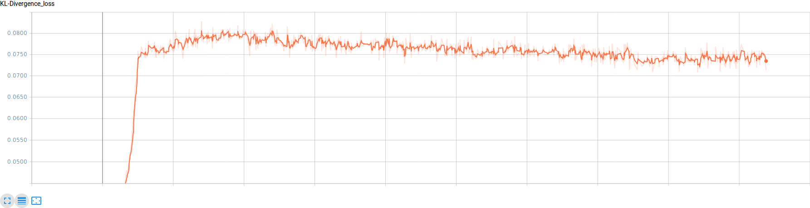</td>
    </tr>
</table>

Generator loss

<table style="width:100%">
    <tr>
        <td align="center">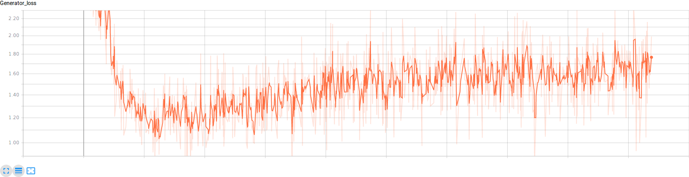</td>
    </tr>
</table>

Discriminator loss

<table style="width:100%">
    <tr>
        <td align="center">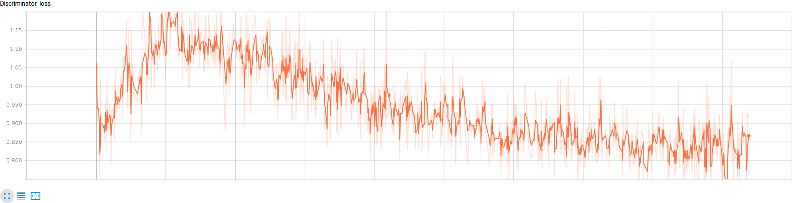</td>
    </tr>
</table>

Discriminator accuracy

<table style="width:100%">
    <tr>
        <td align="center">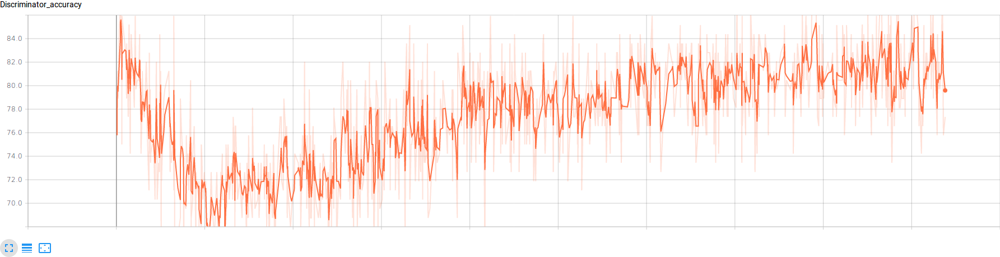</td>
    </tr>
</table>
